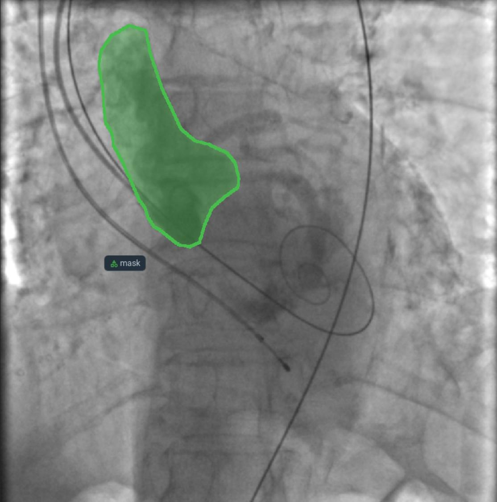
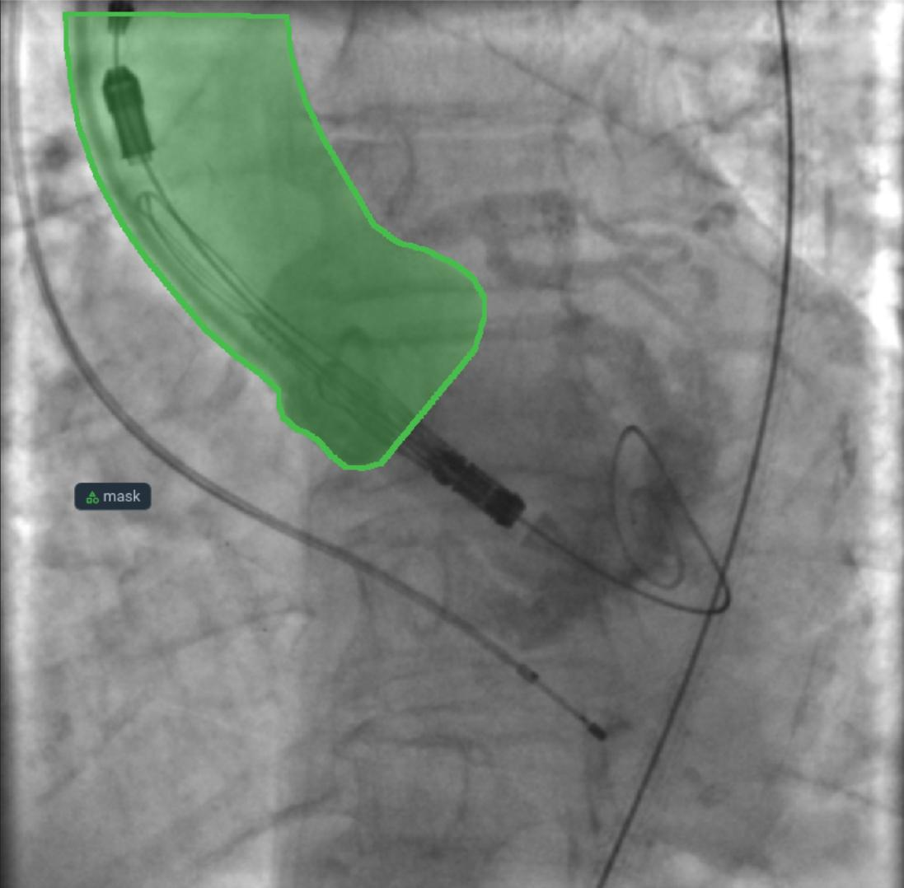
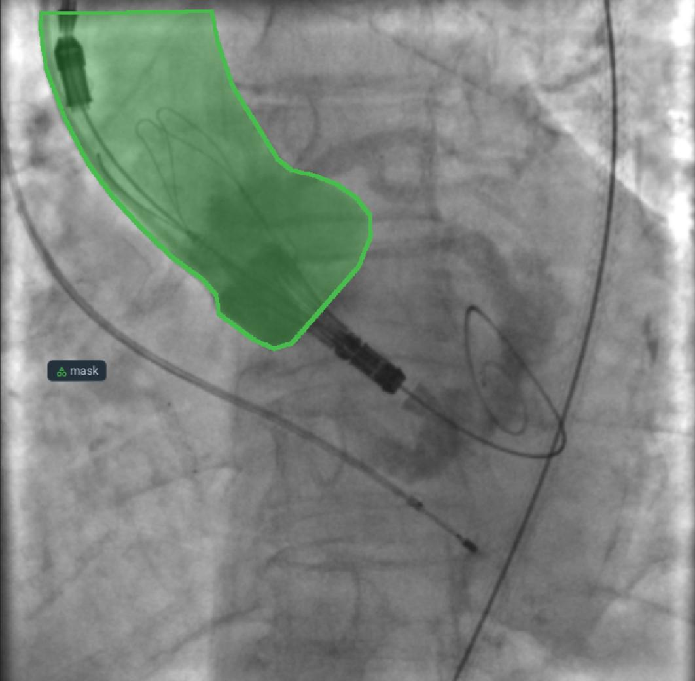
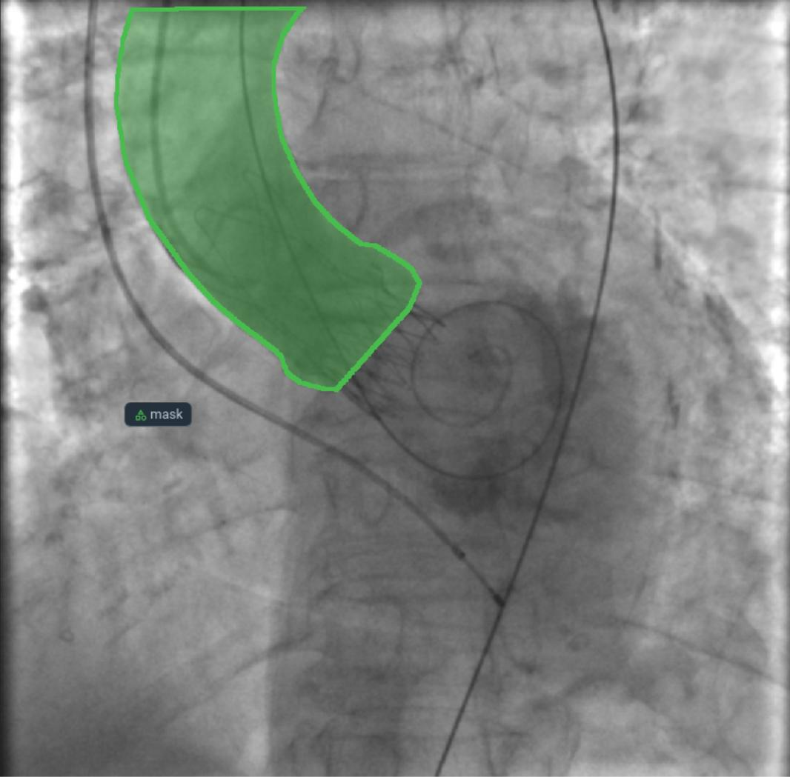

# Segmentation of the aortic root using MO during transcatheter aortic valve implantation

## 📖 Contents
- [Introduction](#-introduction)  
- [Data](#-data)  
- [Methods](#-methods)  
- [Results](#-results)  
- [Conclusion](#-conclusion)  
- [Requirements](#-requirements)  
- [Installation](#-installation)  
- [Data Access](#-data-access)  

---

## 🎯 Introduction
This repository presents an artificial intelligence (AI)-driven approach for the precise segmentation and quantification of histological features observed during the microscopic examination of tissue-engineered vascular grafts (TEVGs). The development of next-generation TEVGs is a leading trend in translational medicine, offering minimally invasive surgical interventions and reducing the long-term risk of device failure. However, the analysis of regenerated tissue architecture poses challenges, necessitating AI-assisted tools for accurate histological evaluation.

## 📁 Data
The dataset used in the study included **2,854 contrast-enhanced images** of **1000 × 1000 pixels** in size with a **color depth of 8 bits** (scale from 0 to 255).  

- **Training set**: ~2,455–2,514 images (87%) from 65 patients  
- **Validation set**: ~340–399 images (13%) from 15 patients

<p align="center">
  
</p>
<p align="center">
  
</p> 
<p align="center">
  
</p> 
<p align="center">
  
</p> 
<p align="center">   
 <em>Figure 1. Data for labeling intraoperative aortography images during the TAVI procedure.</em>  
</p> 

---

## 🔬 Methods
The methodology involved two main stages: hyperparameter tuning and model training. Six deep learning models (U-Net, LinkNet, FPN, PSPNet, DeepLabV3, and MA-Net) were rigorously tuned across 200 configurations to achieve optimal performance. Hyperparameters such as encoder architecture, input image size, optimizer, and learning rate were extensively explored using Bayesian optimization and HyperBand early termination strategies.

Following the tuning stage, the models were trained and evaluated on the entire dataset using a 5-fold cross-validation approach (Figure 2). This ensured the integrity of subject groups within each subset, preventing data leakage. During training, various augmentation techniques were applied to expand the dataset and mitigate overfitting. Besides that, batch size adjusted based on GPU memory utilization (~90-100% usage).

<p align="center">
  
</p>  

<p align="center">
  <em>Figure 2. Comparative analysis of loss and DSC evolution during training and testing phases over 5-fold cross-validation with 95% confidence interval.</em>
</p> 

---

## 📈 Results
DeepLabV3+ and U-Net++ achieved the best DSC values ​​of 0.877–0.881 and had the smallest range of DSC values, which is the most preferred option for clinical trials.
MA-Net and LinkNet also showed good results while requiring less computational resources, which is suitable for resource-constrained systems.
FPN requires additional optimization to reduce the range of DSC values, despite the maximum DSC values ​​of 0.916.
PSPNet is not recommended for tasks that are critical for stability and convergence speed.
| Model        | Convergence (Epoch) | Loss Convergence | DSC Convergence  | DSC Median |
|-------------|--------------------|-----------------|-----------------|------------|
| **U-Net++**    | 20–25              | 0.09–0.11       | 0.911–0.894      | 0.881      |
| **FPN**       | 25–30              | 0.106–0.11      | 0.891–0.894      | 0.871      |
| **DeepLabV3+** | 15–23              | 0.11–0.12       | 0.891            | 0.881      |
| **MA-Net**     | 20–25              | 0.09–0.11       | 0.91             | 0.878      |
| **LinkNet**    | 25–30              | 0.09–0.12       | 0.906–0.882      | 0.877      |
| **PSPNet**     | 25–30              | 0.12–0.13       | 0.855            | 0.854      |

---

## 🏁 Conclusion  
This study highlights the potential of deep learning models for **accurate segmentation of the aortic root**, paving the way for optimized workflows utilizing AI during the **TAVI procedure**. The results contribute to further research in this field and foster the development of intelligent visual assistants.  

---

## 💻 Requirements
Operating System
 macOS
 Linux
 Windows (limited testing carried out)
Python 3.11.x
Required core libraries: environment.yaml

---

## ⚙ Installation
### Step 1: Install Miniconda  
Follow the [installation guide](https://docs.conda.io/projects/miniconda/en/latest/index.html#quick-command-line-install).  

### Step 2: Clone the repository and change the current working directory
``` bash
https://github.com/Nikita75699/segmentation_tavi.git
cd histology_segmentation
```
### Step 3: Set up an environment and install the necessary packages
``` bash
chmod +x make_env.sh
./make_env.sh
```
---

## 🔐 Data Access
All essential components of the study, including the curated source code, dataset, and trained models, are publicly available:

- **Source code:** [https://github.com/ViacheslavDanilov/histology_segmentation](https://github.com/Nikita75699/segmentation_tavi.git)
- **Dataset:** [https://zenodo.org/doi/10.5281/zenodo.10838383](https://zenodo.org/doi/10.5281/zenodo.10838383)
- **Models:** [https://zenodo.org/10.5281/zenodo.15094680](https://doi.org/10.5281/zenodo.15100705)
